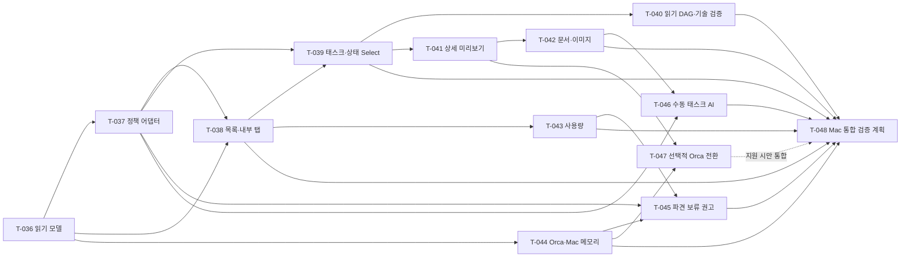

# Phase 2 화면 기반 설계·태스크 관계 — 2026-10-07 KST

사용자는 v7 화면의 기능 범위를 수용하고 화면을 기준으로 태스크 분해·라이브러리·필요 결정을 정리하도록 요청했다. 이후 상태 필터를 공통 Select로 바꾸는 결정을 추가했다. 이 문서는 그 후속 결정을 포함하는 **설계·계획 등록**이다. 모든 새 태스크는 `planning/pending`, `round:null`, `commits:[]`이며 제품 구현·스파이크 실행·모델 호출·설치 승인이 아니다. Phase 1 미완료 판정과 원래 기준·의존성은 그대로 둔다.

## 범위와 확정 화면

note-app은 **관측·리뷰·파견 보류 권고**를 담당하고 실행은 Orca에 맡긴다. 실행 허가/강제 제어/자동 파견/직접 개발 위임/자동 DAG 상태 쓰기를 포함하지 않는다. 프로젝트 목록은 왼쪽에 유지하고 오른쪽 내부 탭은 요약/사용량/태스크·DAG로 나눈다. 태스크 목록이 기본이고 선택 태스크는 오른쪽 상세 미리보기로 연다. 프로젝트·탭·필터·스크롤 맥락을 보존한다.

태스크 상세 헤더는 **태스크 요약 → 선택적 Orca 아이콘 → 닫기 X** 순서다. 기본 무테두리 아이콘에 hover/keyboard focus·tooltip·accessible label을 둔다. 설계/논의 Dialog는 헤더 고정·본문 내부 스크롤, 근거 이미지의 ‘확인’은 큰 Dialog에서 fit/원본/zoom/scroll을 제공한다. 프로토타입의 ‘근거변경체험’ 조작은 제품에 넣지 않고 실제 근거 변경에 따른 stale/갱신 필요 안내로 설계한다. Orca 바로가기는 지원 capability가 있을 때만 별도 명시 동작으로 제공한다.

HTML 상태 Select 수정은 별도 프로토타입 작업자의 범위다. 이 설계 기록으로 HTML 렌더링·실제 연동·제품 구현 완료를 주장하지 않는다.

## 사용자 상태 Select 계약

‘리뷰 필요만’ 체크박스는 제거하고 상단 Select 그룹에 상태 필터를 둔다. 옵션은 사용자 결정 그대로 **전체 / 작업 전 / 진행 중 / 검토 대기(PR 리뷰·태스크 완료 리뷰 포함) / 논의 필요 / 검증 필요 / 완료** 7개다. ‘해석 미확인’은 행의 설명이며 8번째 Select 옵션을 만들지 않는다. 이전 ‘리뷰 필요만에 완료+필수 근거 누락을 포함할지’ 질문은 이 결정으로 대체·해소했다.

| 읽기 계약 | 보존하거나 해석하는 내용 |
| --- | --- |
| 원본 | 프로젝트/DAG/태스크 ID, `rawType`, `rawStatus`, 원래 phase 소속·의존 관계. 원본 lifecycle을 쓰거나 치환하지 않음 |
| 타입 유니온 | 프로젝트별 원래 타입들의 합집합을 포용. 새/미확인 타입도 원래 값으로 남기며 타입과 상태를 서로 대체하지 않음 |
| lifecycle 해석 | 프로젝트 명시 정책·개정·적용 범위에 따른 작업 전/진행 중/검토 대기/완료 의미. 근거가 없으면 해석 미확인 |
| 보조 분류 | 논의 필요·검증 필요는 lifecycle과 독립적으로 겹칠 수 있음. 분류마다 정책/실제 근거/판단 불가 사유 보존 |
| 추적성 | 정책 ID·revision·적용 범위·mappingVersion·source hash·관측 시각·해석 근거·부분 수집/생략 |

검토 대기는 정책상 태스크 완료 리뷰와 실제로 연결·관측한 PR 리뷰 대기를 포용한다. 연결하지 않은 PR이나 단순 링크 존재를 리뷰 완료/대기로 확정하지 않는다. `committed/blocked/deferred/superseded`는 이름만 보고 완료·진행 등의 의미로 고정하지 않는다. 계획 done은 계획 결과물의 완료이며 개발·검증·배포 완료와 별개다. 최신 정책의 기준은 명시 개정 관계와 적용 범위이며 파일 mtime이 아니다. 구형 정책/형식은 호환·마이그레이션 대상으로 읽되 의도적 프로젝트별 완료 기준을 보존한다.

예시는 **설계용 가상 사례**다. 명시 정책상 완료로 해석되는 태스크에 필수 검증 근거가 누락되면 ‘완료’와 ‘검증 필요’ 양쪽에서 찾을 수 있으나 원본 상태는 바꾸지 않는다. 어떤 프로젝트의 `committed`가 리뷰 전 상태인지 완료인지 근거가 없으면 전체 목록에서 원본과 ‘해석 미확인’을 보여 준다. 분류의 중첩·unknown·부분 수집 때문에 필터별 건수 합을 전체 작업 수로 단정하지 않는다. 정책·근거 변경 시 해석 버전과 캐시 유효성을 재평가하며 과거 승인/모델 본문을 자동으로 현재 확정으로 바꾸지 않는다.

## 등록 태스크와 의존 관계

기존 마지막 ID T-035 다음인 **T-036~T-048, 13개**를 기존 feature phase 끝에 추가한다. 아래 의존은 계획/후속 구현에서 재사용할 선행 계약이지 지금 실행 허가가 아니다. 기존 Phase 1 태스크에 새 Phase 2 blocking dependency를 추가하지 않는다. target_files는 현재 공개 설계 문서이며 실제 코드 경로는 후속 착수 전 좁힌다.

| ID | 설계 결과물 | 선행 태스크 |
| --- | --- | --- |
| [T-036](#t-036) | 프로젝트·태스크 읽기 모델 설계 | T-014, T-035 |
| [T-037](#t-037) | 최신 컨벤션·공통 상태 매핑 어댑터 설계 | T-036 |
| [T-038](#t-038) | 프로젝트 목록·내부 탭 화면 설계 | T-036, T-037, T-021 |
| [T-039](#t-039) | 태스크 목록·상태 Select·필터 설계 | T-037, T-038 |
| [T-040](#t-040) | 읽기 전용 DAG·레이아웃 기술 검증 설계 | T-036, T-037, T-039 |
| [T-041](#t-041) | 태스크 상세 미리보기·검토 동선 설계 | T-036, T-037, T-039 |
| [T-042](#t-042) | 안전한 문서·이미지 근거 뷰어 설계 | T-036, T-041, T-011 |
| [T-043](#t-043) | 프로젝트 사용량·그래프 설계 | T-036, T-038, T-028 |
| [T-044](#t-044) | Orca 세션·Mac 메모리 관측 설계 | T-036, T-008, T-002 |
| [T-045](#t-045) | 자원·검토 기반 파견 보류 권고 설계 | T-037, T-043, T-044 |
| [T-046](#t-046) | 수동 태스크 AI 요약·근거 계약 설계 | T-036, T-037, T-041, T-042, T-034, T-035 |
| [T-047](#t-047) | 선택적 Orca 바로가기 capability 설계 | T-041, T-044 |
| [T-048](#t-048) | Phase2 통합 Mac 검증·설치 계획 | T-038, T-039, T-040, T-042, T-043, T-044, T-045, T-046 |

그림은 새 태스크의 관계를 요약하며 아래 표/등록 DAG의 depends_on이 정확한 목록이다. T-047 미지원 자체는 통합의 blocking dependency가 아니며 지원/제외 판단과 근거를 기록한다. Phase 1 선행 ID는 표에만 표시했다.

## T-036

**프로젝트·태스크 읽기 모델 설계** — 관측 출처와 프로젝트 정책 해석을 보존하는 공통 읽기 계약을 정의한다.

선행: T-014, T-035. 상태: planning/pending.

수용기준(설계 결과물 및 후속 검증 계획):

- 프로젝트/DAG/태스크 식별자, 원본 타입·상태·phase 소속·의존 참조, source hash/관측 시각/부분 수집·표시 상한을 분리해 명시한다.
- 공통 표시 계약에 rawStatus/rawType, lifecycle 해석, 논의·검증 필요 보조 분류, 해석 미확인 사유 및 정책 ID·개정·적용 범위·mappingVersion·출처를 보존한다.
- 프로젝트별 원래 타입 유니온과 새로운 타입/상태를 손실 없이 포용하고, 원문 수정·전체 완료·관측 실패를 0/없음으로 바꾸는 추론을 금지한다.
- 후속 검증 계획에 동일 태스크의 정책 개정 전후·unknown·부분 수집·명시 완료지만 필수 근거 누락 사례를 포함한다.

## T-037

**최신 컨벤션·공통 상태 매핑 어댑터 설계** — 명시적 프로젝트 정책으로 원본 상태/타입을 공통 필터에 해석하는 어댑터 계약을 작성한다.

선행: T-036. 상태: planning/pending.

수용기준(설계 결과물 및 후속 검증 계획):

- 최신 명시 정책·개정 관계·적용 범위와 저장소별 의도적 차이를 존중하며 mtime만으로 우선권을 정하지 않는다. 구형은 호환/마이그레이션 대상으로 읽는다.
- 7개 상태 옵션 전체/작업 전/진행 중/검토 대기(PR 리뷰·태스크 완료 리뷰 포함)/논의 필요/검증 필요/완료를 그대로 지원한다. 논의·검증은 lifecycle과 겹칠 수 있는 보조 분류다.
- raw committed/blocked/deferred/superseded를 이름만으로 완료 등에 고정하지 않고 근거 없는 상태는 전체 목록의 해석 미확인으로 보존한다. 매핑 근거·버전과 원본 lifecycle은 불변이다.
- 후속 검증 계획은 정책별 동일 raw 상태의 다른 의미, 계획 done≠개발 done, 외부 의존·이전/폐기 포인터, unknown 타입/상태와 완료+검증 필요 중첩을 포함한다.

## T-038

**프로젝트 목록·내부 탭 화면 설계** — 수용한 화면에 맞춰 왼쪽 프로젝트 목록과 오른쪽 내부 탭의 상태 보존을 설계한다.

선행: T-036, T-037, T-021. 상태: planning/pending.

수용기준(설계 결과물 및 후속 검증 계획):

- 프로젝트 목록은 왼쪽에 유지하고 선택 프로젝트 오른쪽 내부 탭은 요약/사용량/태스크·DAG로 분리한다. 프로젝트 선택을 Orca 전환으로 바꾸지 않는다.
- 프로젝트·탭·목록/상세 스크롤·검색 선택 상태의 유지와 빈 목록/미관측/보존 프로젝트 동작을 명시한다.
- PrimeVue/Vue 기존 스택을 재사용하며 키보드 이동·focus 복귀·선택 설명·좁은 화면 읽기 순서 검증 계획을 작성한다.

## T-039

**태스크 목록·상태 Select·필터 설계** — 목록 기본 화면과 상단 Select 그룹의 공통 상태 필터를 설계한다.

선행: T-037, T-038. 상태: planning/pending.

수용기준(설계 결과물 및 후속 검증 계획):

- 리뷰 필요만 체크박스를 제거하고 상단 select 그룹에 사용자 7개 상태 옵션을 유지한다. 검색·프로젝트 타입 유니온·phase 소속·접두사/기능 필터를 별개로 정의한다.
- 전체 목록에는 해석 미확인도 남긴다. 논의 필요/검증 필요는 보조 분류라 완료 등의 lifecycle 필터와 중첩될 수 있으며 합계가 상호배타적이라고 표시하지 않는다.
- 검토 대기는 정책에 따른 태스크 완료 리뷰와 관측된 PR 리뷰 대기를 포함하고 연결하지 않은 PR을 리뷰 완료/대기로 추정하지 않는다.
- 필터 바깥 의존성·숨김 수·부분 수집을 표시하고 목록 선택/스크롤 및 오른쪽 태스크 미리보기를 유지하는 실제 UI 검증 계획을 작성한다.

## T-040

**읽기 전용 DAG·레이아웃 기술 검증 설계** — VueFlow+elkjs 후보의 짧은 성능·worker·라이선스 검증 후 채택 판단 계획을 작성한다.

선행: T-036, T-037, T-039. 상태: planning/pending.

수용기준(설계 결과물 및 후속 검증 계획):

- 읽기 전용 그래프와 목록 선택 동기화, phase/sub-DAG 소속·외부/미확인 의존·숨김 노드·cycle 진단 계약을 정의한다. 이동/연결/삭제 등 원문 편집 affordance를 활성화하지 않는다.
- 후속 단계에서 허용된 실제 459노드 구조와 500태스크 fixture를 구분해 layout/첫 표시/필터 전환/반복 선택/메모리·UI 응답 비용을 측정한다. 지금 성능 통과나 수치 목표를 꾸며내지 않는다.
- ELK worker의 번들 경로/CSP/취소·종료 및 late-layout 폐기, VueFlow/ELK 및 의존 라이선스 고지·정확 버전 호환성 검토를 채택 gate로 명시한다.
- 측정·라이선스 결과 후 채택/대체/보류를 기록하며 이번 태스크 계획 기록에서 설치·스파이크·제품 구현은 하지 않는다.

## T-041

**태스크 상세 미리보기·검토 동선 설계** — 태스크 이유·수행·논의·근거를 보여 주는 오른쪽 미리보기와 헤더 동선을 정리한다.

선행: T-036, T-037, T-039. 상태: planning/pending.

수용기준(설계 결과물 및 후속 검증 계획):

- 추가 이유/타입·원본 상태·해석/수용기준/변경 파일/의존/검증·미검증/설계·논의 연결을 선언·관측·제안으로 구분한다.
- 헤더 순서는 태스크 요약 → 선택적 Orca 아이콘 → 닫기 X다. 기본 무테두리 아이콘과 hover/keyboard focus·tooltip·accessible label, 닫기 후 선택/focus 복귀를 명시한다.
- 프로토타입의 근거변경체험 컨트롤은 제품에 넣지 않고 실제 변경에 따른 요약 stale/갱신 필요 표시를 설계한다. 상세 헤더 고정·본문 내부 스크롤과 목록 맥락 보존을 검증 계획에 포함한다.

## T-042

**안전한 문서·이미지 근거 뷰어 설계** — 기존 실경로 resolver를 이용한 읽기 전용 문서·설계/논의·이미지 다이얼로그 계약을 작성한다.

선행: T-036, T-041, T-011. 상태: planning/pending.

수용기준(설계 결과물 및 후속 검증 계획):

- 기존 허용 root·등록 경로·정규 실경로·권한/hash 재검증을 재사용하고 wikilink/anchor·이전/폐기 포인터를 해석하며 경로 탈출·symlink 변경·불명 대상을 honest unknown으로 처리한다.
- markdown-it+DOMPurify는 후보로 두고 HTML/scheme·외부 fetch·스크립트·inline event·임의 IPC/파일 열기를 제한하는 정책 및 sanitized 출력 재오염 방지 계획을 작성한다. 실제 버전/라이선스/보안 호환성은 후속 확인한다.
- 설계/논의 Dialog는 헤더 고정·본문 내부 스크롤, 이미지 확인은 큰 Dialog에서 fit/원본/zoom/scroll로 설계한다. 이미지 경로/크기/MIME/누락·취소·변경/키보드 복귀를 검증 계획에 포함한다.
- 파일 존재·스크린샷 저장만으로 검증 판정 진위를 확정하지 않으며 prototype 합성 이미지와 실제 근거 이미지의 표시를 구분한다.

## T-043

**프로젝트 사용량·그래프 설계** — 프로젝트 사용량과 계정 한도·CodeBurn 관측을 혼동하지 않는 내부 사용량 탭을 설계한다.

선행: T-036, T-038, T-028. 상태: planning/pending.

수용기준(설계 결과물 및 후속 검증 계획):

- 오늘/총 토큰·시간 구간·제공자·관측 시각·freshness·집계 범위를 명시한다. 계정 quota와 프로젝트 귀속 및 청구액을 분리하고 귀속 미확인은 미확인으로 남긴다.
- 실제 지원 집계에 한해 그래프를 정의하며 unknown/stale/조회 실패를0으로 그리지 않는다. PrimeVue Chart+Chart.js 후보와 표/텍스트 접근성 대안을 검토한다.
- 후속 검증 계획에 제공자별 missing 필드·부분 실패·시간 경계·aggregate 중복/프로젝트 전환 및 그래프 비용·버전/라이선스 검토를 포함한다.

## T-044

**Orca 세션·Mac 메모리 관측 설계** — 실제 제공 capability를 조사해 세션/워크트리/프로젝트 귀속과 메모리 관측을 설계한다.

선행: T-036, T-008, T-002. 상태: planning/pending.

수용기준(설계 결과물 및 후속 검증 계획):

- Orca running/session/worktree 정보와 optional 프로젝트 메모리 capability의 제공 여부·단위·시점·권한을 확인하는 읽기 전용 계획을 작성한다. 제공되지 않는 기능을 있다고 가정하지 않는다.
- 앱 관련 Electron 메트릭과 외부 프로세스/시스템 압력·swap 및 공유 메모리 이중 합산을 구분한다. macOS에서 없는 지표를0으로 대체하지 않는다.
- 프로세스→세션→워크트리→프로젝트 attribution의 신뢰도·unknown과 종료/공유 프로세스 처리를 정의한다. 사용자 reboot 경험을 원인 측정으로 주장하지 않는다.
- 활성/배경 수집 비용·freshness·권한 거절·프로세스 churn·작업4개 수준 측정 시나리오를 작성하며 프로세스 종료·OS/보안 변경·임의 임계치를 허용하지 않는다.

## T-045

**자원·검토 기반 파견 보류 권고 설계** — 관측과 검토 근거로 추가 파견을 보류할 이유를 설명하는 권고 계약을 작성한다.

선행: T-037, T-043, T-044. 상태: planning/pending.

수용기준(설계 결과물 및 후속 검증 계획):

- 계정 한도·메모리·현재 작업·검증/리뷰 상태·우선순위를 출처/시각과 함께 권고에 사용하며 unknown/stale 때 허가로 해석하지 않는다.
- 실행은 Orca가 담당한다. note-app의 실행 허가·강제 차단·자동 파견·프로세스 종료·직접 개발 위임은 제외한다.
- 사용자 판단/override는 권고 확인 의미로 정의하고 실제 실행 제어를 숨겨 넣지 않는다. 정책/version/권고 사유·관측 비용 및 과한 경고 회귀 시나리오를 기록한다.

## T-046

**수동 태스크 AI 요약·근거 계약 설계** — 태스크 헤더의 수동 요약 버튼과 입력·출처·캐시·내용 평가를 설계한다.

선행: T-036, T-037, T-041, T-042, T-034, T-035. 상태: planning/pending.

수용기준(설계 결과물 및 후속 검증 계획):

- 추가 이유/유형·원본 상태·컨벤션/수행·변경 파일/필요 논의/검증 근거·미검증/설계 연결을 bounded selection으로 요약하고 DAG 선언≠실행 통과를 유지한다.
- 현재 프로젝트와 태스크·source hash·정책 해석/mappingVersion에 입력을 묶고 경고/수동 확인·비밀/개인정보 차단·한도·재사용·동시 실행·취소·늦은 응답·재시작/no-replay 계약을 작성한다.
- 자동 호출/일괄 전송/자동 후보 승인/원문 상태 변경/개발 위임을 포함하지 않는다. 이번 계획 등록에는 추가 모델 호출이 없으며 실제 호출 승인은 후속 실행 범위와 구분한다.
- 후속 실제 내용 평가에서 등록 문서와 최신 관측·사실/제안·정책별 완료/리뷰 차이·누락/생략을 확인하도록 기준과 사용자 읽기 수용 계획을 기록한다.

## T-047

**선택적 Orca 바로가기 capability 설계** — 상세 헤더 Orca 아이콘의 지원 여부와 안전한 프로젝트 전환 계약을 정의한다.

선행: T-041, T-044. 상태: planning/pending.

수용기준(설계 결과물 및 후속 검증 계획):

- 설치 Orca의 읽기 전용 도움말/공개 capability를 확인하는 계획을 기록하고 정규 프로젝트/워크트리 식별자로 화면 전환 가능한지 판단한다. 문자열 명령 삽입/유료 agent 송신을 포함하지 않는다.
- 지원하면 헤더 아이콘·tooltip/keyboard focus/accessible label과 전환 결과·실패를 정의하고, 미지원이면 제외/비활성 사유를 기록한다. 선택적 기능의 미지원 자체가 전체 화면 수용을 막지 않는다.
- 프로젝트 선택은 note-app 상세로 유지하며 Orca 전환은 별도 명시 동작이다. 새 등록·권한/보안 변경이 필요하면 후속 승인 대상으로 남긴다.

## T-048

**Phase2 통합 Mac 검증·설치 계획** — 각 설계 계약의 실제 검증·시각 검토·상태 보존 설치와 사용자 수용 gate를 정리한다.

선행: T-038, T-039, T-040, T-042, T-043, T-044, T-045, T-046. 상태: planning/pending.

수용기준(설계 결과물 및 후속 검증 계획):

- 최종 source/요구 버전·정확 명령·원시 결과·실제/fixture·관측 시각/출처·이미지 실제 열람·파일/IPC 효과와 미검증 범위를 연결하는 검증표를 작성한다.
- 프로젝트/탭/필터/목록·DAG/문서·이미지/사용량·권고/수동 요약의 정상·취소·실패·변경·재시작을 검증 계획에 포함한다. T-047은 지원될 때만 통합하고 미지원은 명시적 제외로 기록한다.
- 459/500 규모 성능과 전체 프로세스/시스템 지표 한계·활성/배경 polling·지원 OS/권한/native 경로를 구분하고 측정 후 수용 목표를 합의한다.
- 후속 설치는 백업·rollback·config/상태/읽기권한/최신12history/AI본문·ledger 보존 및 일반 실행·정확 SHA CI를 요구한다. 이번 planning 문서 검증을 제품 완료/설치/배포로 해석하지 않는다.

## 라이브러리 권고와 채택 gate

현재 저장소의 Vue/PrimeVue **4.5.5** 및 SVG 아이콘을 유지한다. DataTable·탭·Dialog·Tooltip·Select 재사용을 우선한다. 설치된 4.5.5 소스에서 Chart의 `chart.js/auto` 사용과 DataTable의 virtualScrollerOptions 계약을 확인했다. 새 UI 프레임워크나 major 업그레이드를 이 설계의 선행 작업으로 추가하지 않는다.

| 후보 | 설계에 쓰는 이유 | 채택 전 후속 확인 |
| --- | --- | --- |
| VueFlow + elkjs | Vue 그래프 렌더링과 레이아웃 분리 | T-040의 459노드 실제 구조/500태스크 fixture 측정, 읽기 전용 설정, worker/CSP/종료·late 결과, 정확 버전/번들/라이선스 고지 |
| PrimeVue Chart + Chart.js | 기존 컴포넌트로 관측 시계열 표시 | T-043 집계·귀속·unknown/단위·접근 가능한 표, 정확 버전 호환/성능/라이선스 |
| markdown-it + DOMPurify | Markdown 파싱과 출력 sanitization 분리 | T-042 실경로·허용 범위·URL/HTML 정책/외부 fetch 차단/재오염 방지·정확 버전 보안·라이선스 |
| 기존 Dialog + 작은 이미지 viewer | 새 전체 UI 체계 없이 근거 이미지 확대 | T-042 크기/MIME·누락·fit/원본/zoom/scroll·키보드/focus·장시간 해제 |

2026-10-07 KST 문서 대조: [VueFlow 공식 문서](https://vueflow.dev/)는 Vue 3 그래프 인터랙션을 설명한다. [elkjs 공식 저장소](https://github.com/kieler/elkjs)는 렌더러가 아닌 레이아웃 엔진이며 workerUrl 및 terminateWorker 계약을 설명하고, [라이선스 원문](https://github.com/kieler/elkjs/blob/master/LICENSE.md)을 제공한다. 이것은 note-app 번들 성능·배포 라이선스 고지 검증 완료를 뜻하지 않는다.

[PrimeVue Chart 공식 문서](https://primevue.dev/chart/)는 Chart.js 기반과 canvas 접근성 대안을 설명하지만 현재 웹 문서는 5.x로 연결되므로 설치된 4.5.5를 업그레이드하거나 호환 검증 통과로 주장하지 않는다. [markdown-it 공식 저장소](https://github.com/markdown-it/markdown-it)는 파싱/확장 설정을, [DOMPurify 공식 저장소](https://github.com/cure53/DOMPurify)는 sanitization과 후속 변경 시 경계를 설명한다. 특정 후보를 쓰는 것만으로 안전한 파일 열람이 완성되지 않으며 기존 resolver·CSP·출력 정책을 함께 검증한다. 이번에는 후보 설치·제품 스파이크·모델 호출을 하지 않았다.

## 기존 T-029~T-032 이력과 새 범위

| 기존 계획 | 유지할 이력 / 현재 제외·대체 | 새 설계와 관계 |
| --- | --- | --- |
| T-029 쿼터·메모리 실행 정책 | 기존 계획/기준/의존/pending 보존. 실행 허가·강제 제어는 현재 제외 | T-043 사용량, T-044 실제 관측·귀속, T-045 파견 보류 권고로 재분해 |
| T-030 근거 갖춘 개발 위임 | 직접 개발 위임은 현재 제외·대체. 삭제/완료 처리 없음 | T-041/042 검토·근거 뷰어, T-046 수동 태스크 요약으로 읽기·리뷰 계약 재설계 |
| T-031 DAG 갱신 제안·승인 | 원문 쓰기/승인 제안은 이번 수용 화면 범위에 포함하지 않는 보류 이력 | T-036/037/039/040은 읽기·해석·필터·그래프만 설계. 승인 없는 상태 쓰기 금지 |
| T-032 트레이·최근3개 | 별도 트레이/최근 정의 결정은 이번 화면 범위에서 보류. 기존 기준/의존 보존 | T-038은 수용한 왼쪽 목록·내부 탭을 설계하며 트레이 사용 추적을 추가하지 않음 |

원래 태스크의 제목/설명/수용기준/의존/상태를 덮어쓰지 않고 `scope_revision`에 사용자 변경 사유·제외/보류·연결 ID만 기록한다. 최신 적용 정책은 별도 `phase2_observation_review_scope_2026_10_07`로 추가하고 이전 Phase 2 위임 표현은 적용 범위를 명시한 이력으로 보존한다.

## 이번 검증과 남은 결정

이번 검증은 계획 문서·DAG 구조·ID 중복/누락 참조/cycle·기존 태스크 불변·7개 필터/관계 일치 및 정확 Git SHA CI 범위다. planning의 e2e.required=false/covered_by=[]는 실제 구현 검증 완료나 향후 검증 면제를 뜻하지 않는다. 실제 성능·capability·모델 의미 검수·시각 검토·설치는 후속 구현 승인 이후 T-040~T-048 계획에 따른다.

상태 Select 질문은 해소됐다. 남은 후속 결정은 라이브러리 정확 버전/성능·라이선스 채택, Orca 메모리·전환 capability, 수집 귀속/비용과 지원 OS·성능 수용 목표다. 기존 수동 요약 승인과 새 태스크 AI의 실제 실행 범위는 착수 시 구분한다. Phase 1 사용자 읽기 수용과 native 미검증을 이 계획 등록으로 완료 처리하지 않는다.

## 후속 요구: 여러 계정과 프로젝트 소비량의 구분

사용자는 Codex 두 계정과 Claude 두 계정을 사용하며 UsageScope floating widget으로 계정별 한도를 확인한다. T-043은 provider/account/profile별 관측 모델과 프로젝트 소비량 모델을 분리해야 한다. 현재 활성 계정의 quota를 모든 계정의 합계나 특정 프로젝트 소비량으로 확대하지 않고, CodeBurn 집계 기록0/hasUsage=false와도 동일시하지 않는다. 비밀 없는 stable account reference, 출처·관측 시각·연결 범위·unknown 표시 계약을 후속 설계에 포함한다.

UsageScope의 설치 앱 식별·공식 자료·멀티계정 구현 방식은 독립 읽기 조사 중이며 결과를 기다린다. 선언된 계정 수만 계획에 기록하며 현재 모든 계정 연결/수집이 지원된다고 주장하지 않는다. credential/keychain 복사, 새 계정 연결, 인증·설정 변경과 제품 구현은 이번 범위에 없다. 원래 T-043의 pending 상태·수용 기준·의존성은 보존한다.

독립 조사 보고에서 설치 앱은 UsageScope1.2.20/build127(`com.usagescope.app`)로 식별됐고 계정 추가/관리·계정별 gauge·last success를 지원한다고 확인했다. 이 기록은 설치 버전이며 최신 버전이라는 주장은 아니다. [공식 소개](https://usagescope.com/)는 한도와 사용 이력을 소개하며, [공식 지원](https://usagescope.com/support)은 제공 한도·리셋 시각이 서비스와 계정에 따라 달라진다고 설명한다. [개인정보 정책](https://usagescope.com/privacy)은 credential과 usage cache가 보호된 로컬 저장소에 있다고 설명한다. 이번 조사에서 문서화된 외부 export/API/CLI는 찾지 못했으며, 존재하지 않는다고 확정하지 않는다. private credential/cache/UI는 읽지 않았다.

현재 note-app의 quota decoder는 provider별 한 행이며 account/profile 필드가 없고 같은 provider 중복을 거절한다. 여러 계정은 기존 배열에 행을 추가하는 것만으로 해결되지 않으므로 T-043에 다음 두 조사 작업을 명확히 포함한다.

1. **계정 모델:** `provider → account/profile reference → quota window`. 계정마다 observedAt·lastSuccess·리셋·error를 보존한다. 프로젝트 소비량은 별도 관측으로 두고 귀속을 증명하지 못하면 unknown을 유지한다. 서로 다른 계정의 퍼센트를 합산하거나 평균하지 않는다.
2. **수집 인터페이스:** 공식 또는 사용자 승인 가능한 계정별 read-only 수집의 identity·scope·capability·권한·오류 계약을 조사한다. UsageScope 인증정보/keychain/private cache를 복사하거나 내부 저장을 임의 bridge로 쓰지 않는다. 새 계정 연결은 대상/권한/입력을 구체화하고 추가 승인 이후 수행한다.

현재 CodeBurn quota는 **조회 계정 식별 미확인**이다. 이를 명시하는 Phase1 최소 표시를 후속으로 검토하되 이번 결정은 설계 기록만이며 제품 구현·새 연결은 하지 않는다. 계정별 현재 퍼센트와 개인정보를 공개 문서에 옮기지 않는다.
